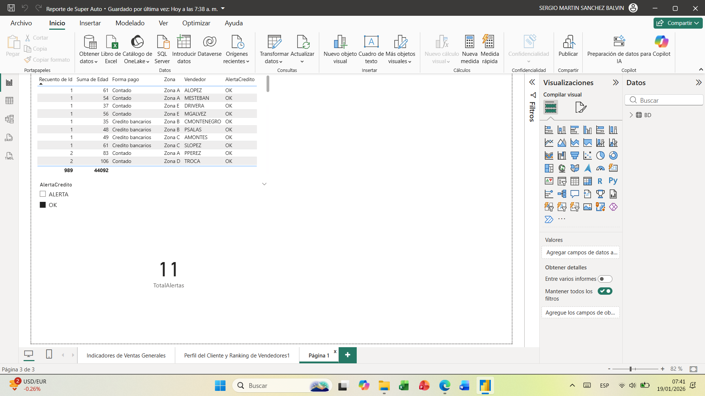

# Dashboard Comercial Súper Auto (Power BI)

**Dashboard interactivo de ventas diseñado para apoyar la toma de decisiones estratégicas en “Súper Auto S.A.”**

---

## Resumen del Proyecto
Este dashboard en Power BI ofrece una visión completa del desempeño de ventas, ranking de productos, seguimiento de comisiones y alertas de riesgo crediticio según las políticas de la empresa.  
Permite a los gerentes identificar rápidamente los productos más vendidos, las zonas de mayor rendimiento y operaciones con posible riesgo de crédito.

---

## Impacto en el Negocio / Resultados Clave
- Monitoreo de ventas por más de **29M en ingresos** con **más de 1,000 transacciones**.  
- Identificación de las zonas de mayor rendimiento: **Zona B y Zona C**.  
- Destacado de los productos más vendidos: **categorías Hatchback y Sedán**.  
- Detección de **11 operaciones con riesgo crediticio** antes de ser escaladas.  
- Entrega de **KPI e insights automatizados**, reduciendo significativamente el tiempo de generación de reportes manuales.

---

## Tecnologías Utilizadas
- Power BI Desktop  
- Microsoft Excel (como fuente de datos)  
- Modelado y transformación de datos  
- Cálculos DAX y visualizaciones interactivas

---

## Aspectos Destacados del Dashboard
- **Resumen de Ventas:** Total de ingresos, transacciones y productos más vendidos.  
- **Ranking de Comisiones:** Mejores vendedores por zona.  
- **Alertas de Riesgo Crediticio:** Detección automática de transacciones de alto riesgo.  
- **Análisis por Segmentación:** Desglose de productos y zonas para insights estratégicos.

**Capturas:**  
  
  
  

*(Reemplaza `img/*.png` con tus capturas reales guardadas en la carpeta `/img`)*

---

## Cómo Usar
1. Descarga el archivo `.pbix`.  
2. Ábrelo con **Power BI Desktop (versión 2022 o superior)**.  
3. Conecta a tu fuente de datos o usa los datos de ejemplo proporcionados.  
4. Explora los gráficos interactivos, filtros e insights.

---

## Aprendizajes y Habilidades Demostradas
- Creación de **dashboards interactivos** para escenarios de negocio reales.  
- Transformación de **datos en insights accionables** para la gerencia.  
- Aplicación de **mejores prácticas en Power BI**: modelado de datos, KPIs y automatización.  
- Comprensión de **requerimientos de negocio** y entrega de visualizaciones de alto impacto.
