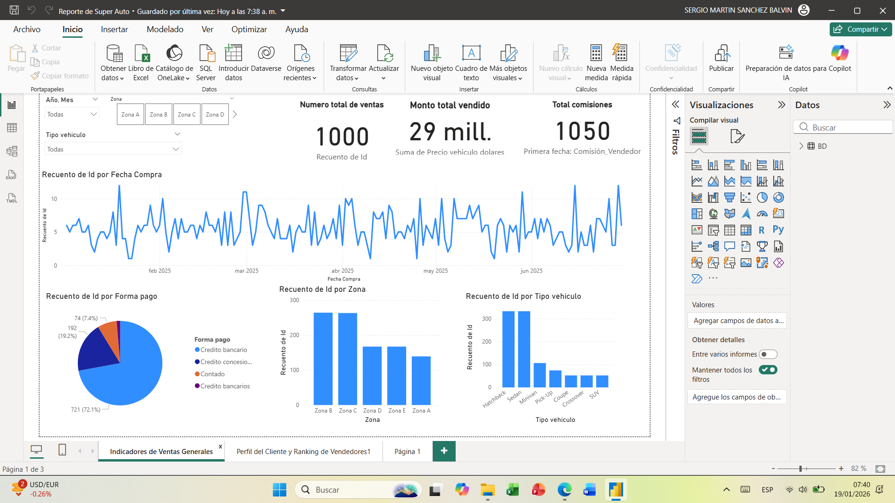
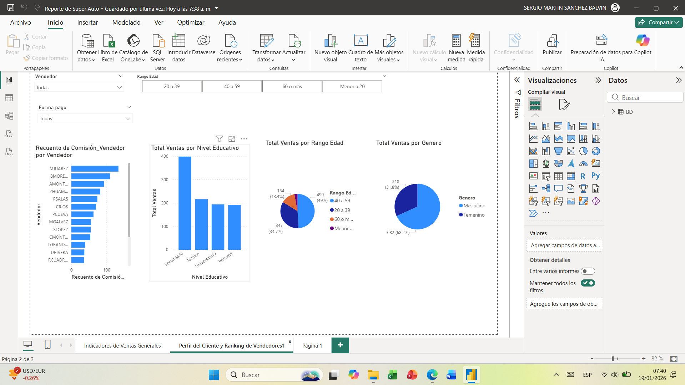

# Super Auto – Dashboard de Ventas en Power BI

## Objetivo del proyecto
Desarrollar un dashboard interactivo en **Power BI** para analizar el desempeño comercial de la empresa **Super Auto**, permitiendo monitorear indicadores clave de ventas, comisiones, perfil del cliente y riesgos asociados a operaciones de crédito, con el fin de apoyar la toma de decisiones del área comercial y financiera.

---

## Contexto de negocio
La empresa comercializa vehículos a través de distintos vendedores, zonas geográficas y formas de pago.  
El dashboard responde a preguntas clave como:

- ¿Cuál es el volumen total de ventas y su evolución en el tiempo?
- ¿Qué zonas y tipos de vehículos generan mayor cantidad de ventas?
- ¿Cuál es el perfil del cliente que más compra?
- ¿Qué vendedores presentan mejor desempeño?
- ¿Existen operaciones con riesgo crediticio que deban ser monitoreadas?

---

## KPIs y métricas principales
- Número total de ventas  
- Monto total vendido  
- Total de comisiones  
- Ventas por zona  
- Ventas por tipo de vehículo  
- Ventas por forma de pago  
- Ranking de vendedores  
- Alertas de crédito  

---

## Herramientas utilizadas
- **Power BI**
- **Microsoft Excel** (fuente de datos)
- Modelado y transformación de datos

---

## Insights clave
- El monto total vendido supera los **29 millones**, con **1,000 transacciones** registradas.
- Las **zonas B y C** concentran el mayor volumen de ventas, convirtiéndose en zonas estratégicas para acciones comerciales.
- Los vehículos **Hatchback y Sedán** son los más vendidos, mientras que SUV y Crossover presentan menor participación.
- El **crédito bancario** es la forma de pago predominante, representando más del **70 %** de las operaciones.
- El rango de edad **40 a 59 años** concentra la mayor cantidad de ventas.
- El género masculino representa aproximadamente **dos tercios** de los clientes.
- Se identificaron **11 alertas de crédito**, lo que permite anticipar riesgos financieros.
- El ranking de vendedores facilita la identificación de **top performers** y oportunidades de mejora.

---

## Estructura del dashboard
- **Indicadores de Ventas Generales:** visión global del desempeño comercial.
- **Perfil del Cliente y Ranking de Vendedores:** análisis demográfico y desempeño individual.
- **Control y Alertas:** monitoreo de operaciones con riesgo crediticio.

---

## Aprendizajes
- Diseño de dashboards orientados a negocio.
- Análisis de datos comerciales y financieros.
- Creación de KPIs para toma de decisiones.
- Uso de Power BI para segmentación y visualización de información.

---

## Capturas del dashboard
*(Agregar aquí 2 o 3 imágenes del dashboard)*
## Capturas del dashboard

---

## Resultado
Este proyecto demuestra la capacidad de **analizar datos comerciales**, **extraer insights relevantes** y **presentar información clara y accionable**, alineada a las necesidades de negocio.

---

### Nota
Este repositorio forma parte de un portafolio orientado a **prácticas y posiciones junior en Data Analytics, Business Intelligence y Automatización**.
